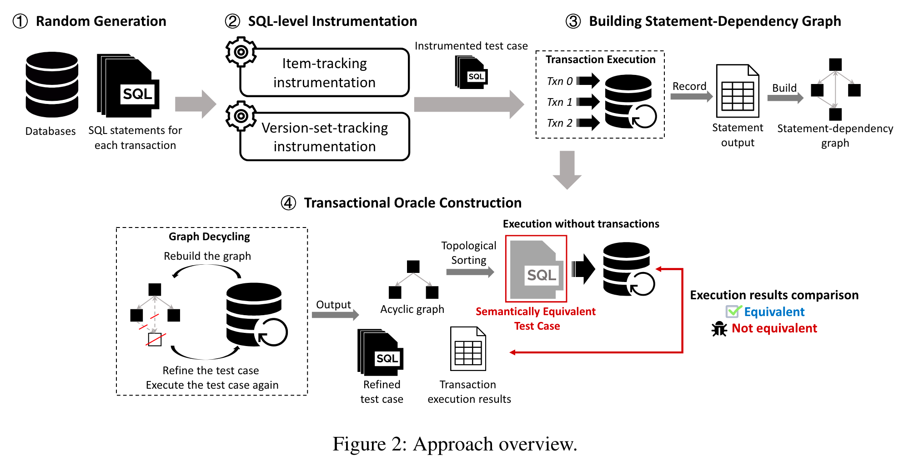

# 问题

保证数据库中事务正确性很重要。现有的方法使用特定操作模式来捕获违反事务规则的行为。方法缺陷有：

* 只使用特定操作模式来捕获违反事务规则的行为，**不能检测到很多复杂操作带来的错误**
* 现有方法无法处理**谓词**，如WHERE中的条件表达式
* 现有方法侧重测试**隔离级别**，可能会遗漏错误

# 想法

生成**语义等效**的测试用例：

* 事务形式的测试用例
* 非事务形式，通过重排列保证效果相同的执行用例

# 方案

* 提出**语句依赖图**
* SQL级别插桩
* 构建等价测试用例并比较

# 实验

* Bug比较：与原有的一个事务Bug检测工具进行比较，证明能找到之前工具不能找到的错误
* 消融实验：证明策略有效性

# 总结

本文在数据库的事务Bug检测方面做了进一步探索，通过图的方式进行等价变换。
