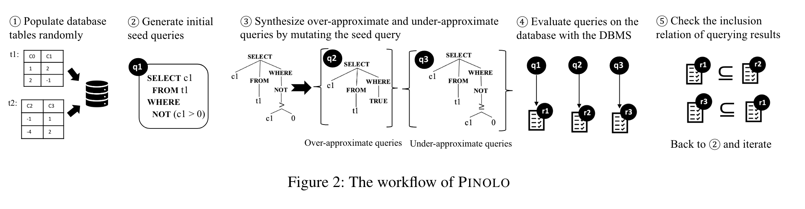

# 问题

测试数据库的**逻辑问题**很重要。挑战是制定**有效的测试准则**。

现有工作：

* 差分测试如RAGS受到方言限制
* 测试准则引导的合成方法如PQS，只检测Where情况，并且需要领域知识
* 蜕变测试如NoREC，只能检测**等价关系**

# 想法

给定查询的结果本质上是元组的多重集合。可以用**多集合之间的包含关系**作为测试准则。

通过构造集合的子集或超集，放宽了等价关系，能够找到更多错误。

# 方案

* 定义SQL近似关系：如果他们返回的结果是包含关系则两个SQL具有近似关系
* 定义近似变异：近似变异能够将查询q映射为另一个和q具有近似关系的查询q'
  * 突变关系
  * 突变谓词
  * 突变比较
* 基于变异的查询合成

# 实验

* Bug总数
* 与Baseline比较24小时Bug数、覆盖率
* 从不同的初始种子开始测试

# 总结

引入集合关系来构造变质测试，不再局限于等价关系。
