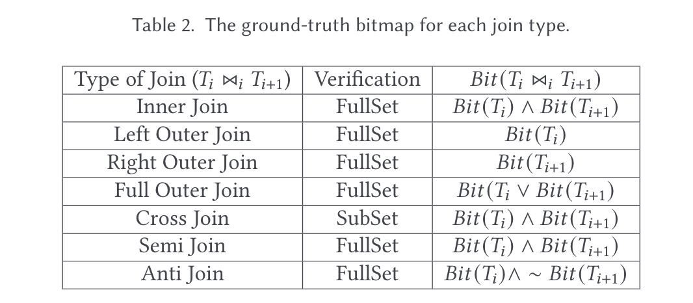

# 问题

针对数据库逻辑错误的检测，过往工作，如PQS等只**针对单表选择**查询的检测。

检测多表查询的难点：

* 构建有效的Oracle验证结果
* 多表查询的搜索空间很大，需要高效的搜索方法

# 想法

提出TQS方法用于解决JOIN相关的逻辑错误。基本思想是将宽表拆分为多个表，基于此生成特定的连接查询，通过差分发现逻辑错误。

# 方案

1. DSG:

   1. 通过函数依赖（FD）拆分宽表，并构造位图索引
   2. 通过注入边界值和空值来提高触发Bug的概率
   3. 在模式图上随机游走，生成Join语句
   4. 根据Ground Truth生成差分对比结果

   
2. KQE:

   1. 约束查询生成算法，通过分析schema graph同构来减少冗余查询

# 实验

* Bug数+严重性+举例
* 与SQLancer对比
  * 查询图多样性
  * 生成Query和检测Bug的效率
* 消融实验

# 总结

本文构建Ground Truth作为Oracle，并且引入图来构造和比较路径。Ground Truth的思路可以学习。
