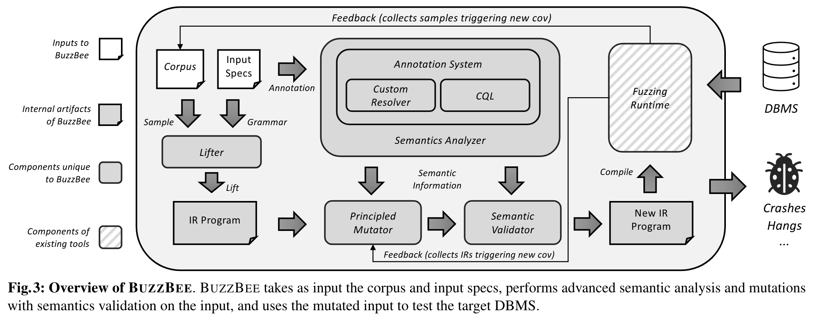

# 问题

DBMS种类有很多，尽管关系型数据库的Fuzz工具已经很成熟，对于非关系数据库上的拓展还有很多挑战。

* 接口和输入方式多样
* 语义可能根据上下文改变
* 随机变异的效率低

# 方案

使用三种策略来分别解决三种挑战：

* 语义抽象：树状IR，通过Define、Use、Invalidate来抽象数据库的接口语义
* 上下文敏感的约束分析：CQL用于查询上下文信息，自定义解析器实现动态约束解析
* 依赖引导变异：从语义分析器中查询依赖信息，并执行相应的变异

# 实验

* 通用性：移植到八个不同数据库上，备注了每个数据库的种子来源和语法来源
* 消融实验：验证语义正确率、Coverage、Bug Finding效果
* 和多种Fuzz工具比较
