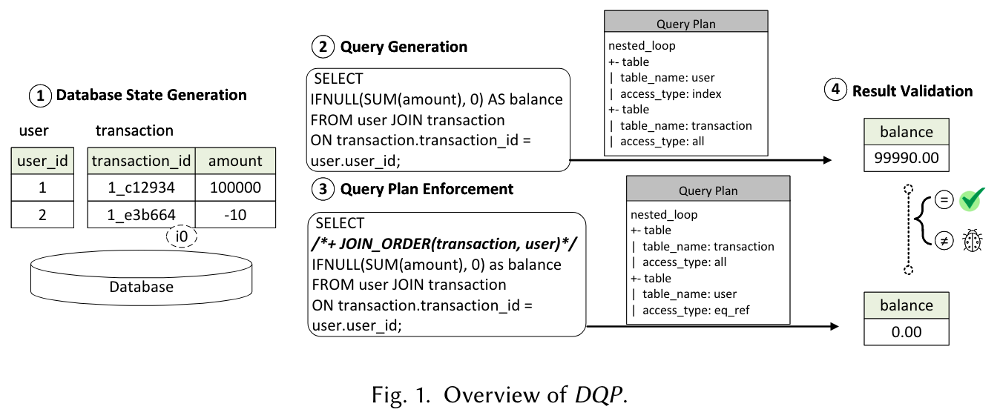

# 问题

之前的工作如TQS通过拆分表为多个子表，并连接表中数据来寻找JOIN查询中可能存在的错误。然而，该方法有两大挑战：

* 方法复杂：需要参考给定的表来拆分和维护schema，并且将schema建模为图来评估查询的相似性
* 检测范围小：仅适用于等值连接

# 想法

提出Differential Query Plan（DQP）来弥补TQS的不足，具体来说，比较同一个查询在不同执行计划下的结果。如果不同，则发现了可能的Bug。DQP可以测试除了JOIN语句之外更多的查询优化。

# 方案

影响Query Plan的方式：

* Query hint：在 SQL 查询中嵌入的特殊注释以指导优化器执行查询，如/*+ JOIN_ORDER(table1, table2) */
* System variable：设置系统变量 `optimizer_switch`

消除随机结果的方式：改变数据的排列方式，观察结果是否会改变

# 实验

* 能否发现TQS过往的Bug + 找到的新Bug
* 与NoREC和TLP进行对比，Bug是互补的。比较方式：将DQP的查询转化成NoREC和TLP的方式
* Query Plan的覆盖率/ 使用的hint和变量的覆盖率/ Join运算符的覆盖率/ 代码覆盖率

# 总结

在TQS的基础上进行改进，首先调研了TQS的错误报告，这使得作者能够自然的进行下一步研究。在实验覆盖率计算上也考虑的很全面，可以学习。
