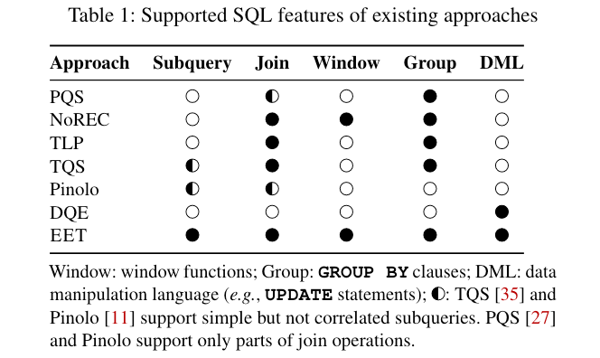
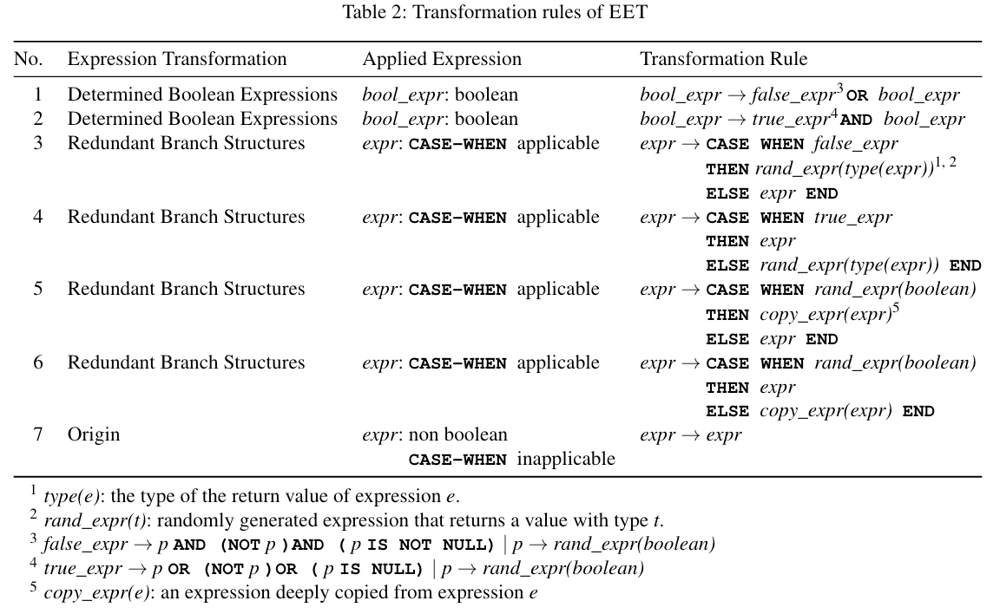

# 问题

现有的检测数据库逻辑错误的方法通用性有限，它们一般是通过对特定的查询模式进行变换来测试的。现有的方法都无法涵盖所有列出的SQL功能，因此还会遗漏许多逻辑错误。

# 想法

使用更细粒度的表达式级操作来检测逻辑错误，通过等价表达式转换，来确保转换后的查询与原始查询产生相同结果。

# 方案

1. 遍历AST中的每个表达式，根据类型应用等价转换规则。
   * 对于布尔表达式，使用逻辑等价性定律进行转换。
   * 对于非布尔表达式，使用SQL分支结构（如CASE WHEN）进行转换。
2. 生成转换后的查询，并对原始查询和转换后的查询进行结果比较。
3. 通过测试用例简化，减少冗余表达式以生成最小的触发逻辑错误的查询。

# 实验

1. 发现的Bug种类、重要性、吞吐量
2. Bug覆盖的Feature多样性
3. 比较试验：通过调查每个逻辑错误的最早错误诱发版本来查看是否发现被现有方法遗漏的错误
