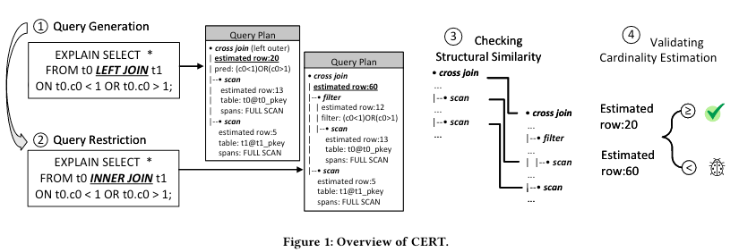
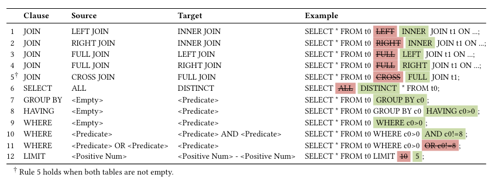

# 问题

寻找数据库中的**性能问题**具有挑战性。

现有工具：

* TPC-DS或TPC-H等基准集：只能测试基准集上的性能错误。并且要划定性能baseline也具有挑战性
* APOLLO：只用于检测性能回归问题
* AMOEBA：产生很多误报，并且需要在足够大的数据库上执行

# 想法

通过测试数据库中的**基数估计*Cardinality Estimation***来测试性能问题。基数估计器的作用是估计查询中的每个操作会返回多少行。

**Insight：当给出一个更严格的查询时，基数估计器返回的行数应当不多于原有的查询。**

# 方案

1. 随机生成查询
2. 推导更严格查询
   1. 添加子句
   2. 修改谓词
3. 查看查询计划，如果是相似的，则进行比较
   1. 首先将查询计划序列化
   2. 如果查询计划之间通过一个编辑距离就能够达到，则认为它们相似
4. 验证基数估计结果

# 实验

1. 有效性：能否找到unknown bugs
2. 历史性：能否找到积年的bug。使用CERT为历史问题报告构建查询，并检查这些查询是否在修复之前能触发bug，在修复之后不再触发bug
3. 准确性：能否产生更少误报
4. 效率：相同时间能否找到更多bug。比较运行测试用例的个数
5. 敏感性：哪些制定的SQL规则最有效

# 总结

本文从数据库的一个组件（基数估计器）出发，通过很小的工作量改进，取得了不错的效果。利用集合关系来扩大或缩小SQL是近年流行的思路。此外，论文的行文思路是很清晰的，还要多学习论文的写作思路。
