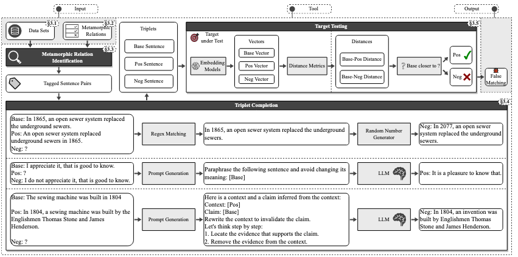
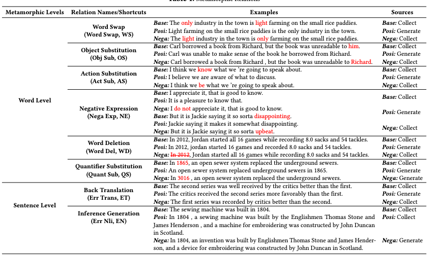

# 问题

目前 RAG 和 CAG 已经在 LLM 领域中被广泛使用，为作为技术支撑的矢量数据库带来了严峻挑战。主要体现在两个方面：漏匹配和错误匹配。现有方法还缺乏对这一领域的研究。

# 想法

从数据集中识别变质关系，并利用关系将测试用例构建成三元组：基本句子、一个语义相似但结构不同的肯定句、一个具有相反含义的否定句。

# 方案

1. 从 6 个 NLP 数据集（如 Stanford Contradiction Corpora、PAWS 等）中分析句子对，提炼出 8 种蜕变关系：

2. 三元组构建：基于上述的 MR ，构建 (base, positive, negative) 三元组。正句与基句 **语义一致但结构不同** ，负句与基句**语义相反但结构相似。**
3. 变质测试： 
   1. 使用相同嵌入模型将句子映射为高维向量
   2. 采用 **指定的距离度量** （如余弦距离、欧氏距离等 7 种 metrics），分别计算 “Base 向量与 Positive 向量的距离（B-P 距离）” 和 “Base 向量与 Negative 向量的距离（B-N 距离）
   3. 进行判断，若 B-P 距离 < B-N 距离，说明向量匹配方法优先选择语义相似的 Positive，无虚假匹配；若 B-P 距离 > B-N 距离，说明方法误将语义相反的 Negative 判定为更相似，存在虚假匹配

# 实验

* 生成的测试用例是否符合要求
  * 基于三人标注结果，通过两轮标注 + 多数判断决定
* 能否检测到向量数据库的错误
  * 错误匹配：Chroma 存在明确的虚假匹配案例（如误选含 “not” 的负句）
* 方法对向量数据库检测率的影响
  * 论文中 203 种向量匹配配置的平均准确率下降幅度超 78.07%（如 Annoy 数据库从 99.72% 降至 37.72%，下降幅度约 62.27%），此指标直观体现 MeTMaP 能显著暴露信息检索方法的错误输出
* 不同因素对方法的影响：
  * 向量匹配方法对**结构变化**更敏感—— 词级 MR（如词交换、对象替换）的负句平均距离更低，对应虚假匹配更多；句级 MR（如回译、推理生成）因结构变化大，虚假匹配更少；
  * 通过更改语句的输入顺序，能够找到单项不一致性问题

# 总结

通过生成模糊匹配句式来进行变质匹配，这个想法是可行的。但是具体对向量数据库的检测效果只有自测实验数据，缺乏开发者反馈。
