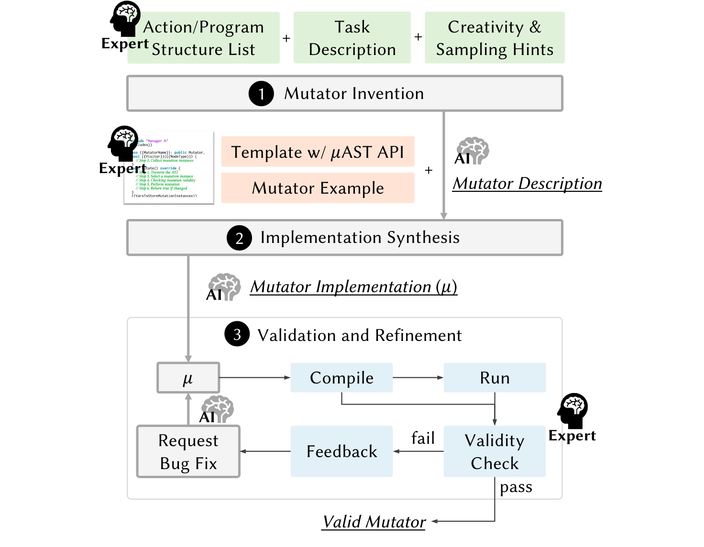

# 问题

在基于变异的模糊测试中，Mutator定义了整个搜索空间，决定着整个方法的有效性。但生成高质量的Mutator是富有挑战并且高成本的。

# 想法

利用LLM来缩小生成Mutator的成本。

# 方案

1. Mutator Invention: 这
   1. 一步不生成程序，只给LLM列出操作的类型以及可选的程序结构，让LLM随机生成Mutator的名字和自然语言描述
   2. Trick：是将温度值设定的很高，以期望LLM产生更多有趣的描述
2. Implementation Synthesis:
   1. 首先由人类提供程序模版，提示LLM需要补全的内容。在生成代码时，构建CoT一步一步提示LLM应该如何生成
   2. Trick：将Clang AST API封装成更简洁的API便于LLM理解
3. Validation and Refinement: LLM生成的程序可能会有编译错误，根据错误信息反馈给LLM进行修正

# 实验

* 对生成的Mutator的种类和成本进行调研
* 对比MetaMut生成的mutators与现有模糊测试工具（如AFL++、Csmith等）在GCC和Clang编译器上的代码覆盖率和独特崩溃数
* 测试不同模糊测试工具生成的Mutator中，可编译Mutator的比例，评估其语义感知能力
* Bug数目

# 总结

LLM的输出本身就是具有不确定性的，将这种不确定性应用到生成随机Mutator这种需要不确定性的任务中，实现了很好的结合。
