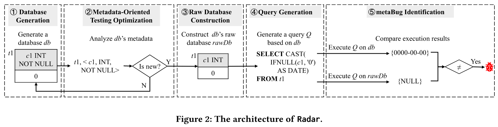

# 问题

数据库元数据用于描述数据库的结构、索引、存储配置等。数据库利用元数据来保证数据库中的数据完整性和优化查询。

**问题：** 缺乏有效的Oracle来测试元数据错误。现有的测试逻辑错误的工作不能提供有效的关于元数据的变异。

# 想法

首先随机生成一个包含元数据的数据库DB，再生成一个不包含这些元数据的数据库RawDB，它们的数据相同。比较相同查询在这两个数据库上的查询结果，如果不一致，说明存在元错误。

# 方案

* 生成数据库：作者将元数据划分为五类：Data type、Column Constraint、Table Constraint、Index、Table Configuration。选择不同的元数据生成原始DB，然后抹去其中可选择的元数据
* Query生成：主要生成select-from-where查询，Radar生成的查询不能包含随机结果，因为要确保DB和RawDB上结果的一致性
* 优化：尽量避免生成重复的元数据

# 实验

* Bug情况，包括Status、Severity、Bug Type
* 消融实验：对比24小时的Coverage和Bug数
* 和SQLancer的Oracle对比效果，有Conceptual和Experimental的分析
* 实验还补充了其他数据，如构建数据库的时间/产生Query的速度

# 总结

文章的细节写的很详细，比如如何生成Query，以及实验过程中的分析。
