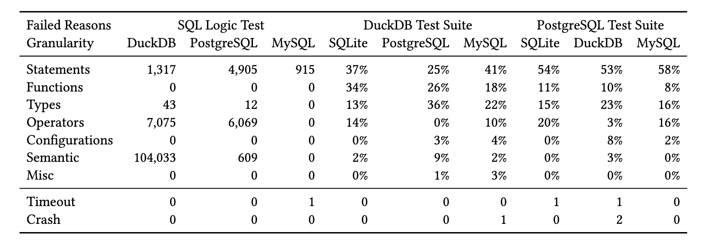
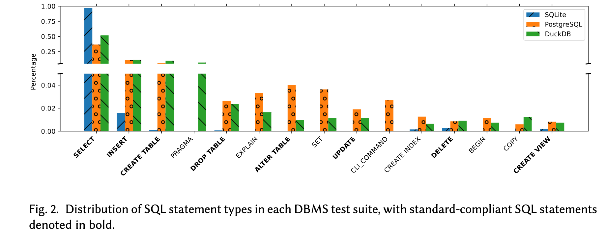
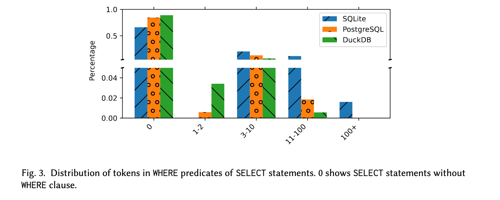

# 问题

DBMS通常包含大规模的测试套件，这些测试套件由SQL测试用例和测试运行器组成。然而，测试套件在不同DBMS间并未被系统性复用，导致了大量重复开发工作。

主要挑战在于：

* **测试格式差异** ：不同DBMS测试套件使用不同的测试用例格式，部分依赖特定的注释或额外命令
* **SQL方言差异** ：虽然SQL有标准化规范，但各DBMS对标准的实现存在显著差异
* **执行依赖问题** ：测试用例常包含显式或隐式的环境依赖（如配置变量或扩展功能），阻碍了跨DBMS复用

# 方案

构建统一的测试套件（SQuaLity）和对现有DBMS测试套件进行系统性分析以解决这些问题：

* 测试用例抽取与格式统一：从SQLite、PostgreSQL和DuckDB的测试套件中提取测试用例，并使用解析器将不同测试格式转化为统一的内部中间表示
* 开发统一的测试运行器：使用Python实现测试运行器，兼容多种DBMS并支持验证测试结果，运行器支持跳过特定DBMS不支持的测试命令
* 跨DBMS测试分析：
  * 运行测试用例以评估不同测试套件的标准化程度、依赖和兼容性
  * 调查失败测试用例的根因，包括语法、语义和环境依赖问题

# 实验

* **RQ1** : 各DBMS测试框架的功能特性？
  * 不同测试套件在测试命令、结果格式等方面差异显著
* **RQ2** : 测试用例通常是什么样的？
  * SQLite的测试用例99.76%为标准SQL，DuckDB和PostgreSQL分别为76.14%和68.89%
  * 平均有 10.6%的语句在测试套件中很少使用，例如WITH语句(0.48%)和用于运行存储过程的EXECUTE语句(0.39%)
  * 大多数 SELECT 都相当简单，如图 3，大多数查询（即 79.9%）甚至缺少 WHERE 子句
* **RQ3** : 测试执行的主要挑战？
  * 失败主要因环境设置（88% PostgreSQL）、特定扩展依赖（10% PostgreSQL）和客户端格式差异（77% DuckDB）
* **RQ4** : 测试套件是否能跨DBMS发现问题？
  * 发现3个崩溃、3个挂起及若干兼容性问题，其中部分已被开发者修复

