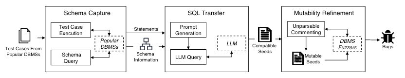

# 问题

有效的数据库模糊测试依赖于**高质量的初始种子**。但许多数据库**缺乏全面的测试用例**作为初始种子。直接合成高质量的初始种子是很困难的。

现有的基于突变的数据库模糊测试工作依赖于从数据库的内置单元测试用例和回归测试用例中收集SQL种子。

# 想法

通过从其他数据库**迁移测试用例**，为目标数据库生成初始种子。能够这么做的原因在于，许多数据库都具有相似的功能，因此一个数据库中的高质量种子可以迁移到别的数据库。

**挑战**：如何将原始种子转换为目标数据库语法所支持的形式。

# 方案

1. 首先在原数据库上执行SQL测试用例，收集每个SQL的schema信息
2. 将测试用例和schema给LLM来进行转换
3. 当提供给对应的数据库fuzzer时，注释掉该fuzzer不能变异的SQL语句

# 实验

* Bug检测情况
* 覆盖率提升 + Bug数提升 + Bug之间的关系 + 重复实验p值
* 消融实现，比较语义正确率、语法正确率、覆盖率的提升；并统计了正确的语句多包涵的函数类型、数据类型、关键字

# 总结

提问：

* 在选择用来迁移的种子时，如何判断种子是否是高质量种子？

本文的实验部分做的很详尽，值得学习。想法虽然简单但是很有效果。通过使用LLM能够很好的解决现有的问题。
