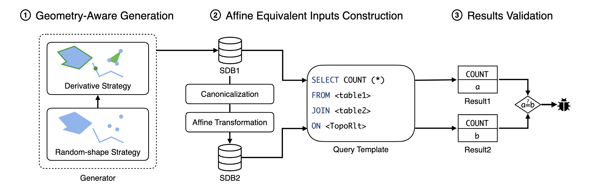

# 问题

空间数据库管理系统（SDBMS）广泛应用于地理信息系统、计算机辅助设计工具和基于位置的服务等现代应用中。SDBMS 存在逻辑错误，现有方法无法有效检测这些错误：

* 差分测试的局限性在于检测不出共享第三方库中的错误/ 并且很多数据库之间实现存在差异，很难使用差分
* 原有的生成语句并且构建预期结果的方法如 TLP 无法适配到空间数据上

# 想法

提出了一种名为仿射等效输入 (AEI) 的方法来为 SDBMS 提供预期结果：**如果两个几何图形以相同的方式进行仿射变换（例如旋转、缩放和平移），则拓扑关系（例如相交、覆盖或不相交）将被保留**。

# 方案

* 生成空间数据：
  * **随机形状策略：** 随机生成语法上合法的几何图形（如点、线、多边形等）
  * **派生策略**：利用已有的几何图形，通过应用空间编辑函数（如对多边形进行修改或分解）生成新的几何图形
* 仿射等价输入构造：构造两个几何数据库，分别表示“仿射等价”的几何
  * 对几何进行规范化处理，例如去除重复元素、重新排序、或将几何转换为标准格式（如确保多边形的边界按照顺时针方向排列）
  * 对SDB1中的几何数据应用数学上的仿射变换转换成 SDB2
* 在两个数据库（SDB1和SDB2）上运行相同的查询，这个查询包括拓扑关系函数，并且对比结果是否一致

# 实验

* Bug 调研
* 与 TLP找到的 Bug 进行比较，并且还对比了差分测试相关策略
* Efficiency 调研
  * 运行时间和几何数量的关系
  * 覆盖率相对于单元测试的提升
