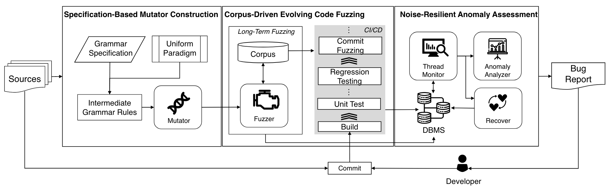

# 问题

现有的模糊测试工具需要针对特定版本的DBMS进行定制，无法适应企业级DBMS的快速版本迭代：

* SQL语法的多样性
* 代码库的持续迭代为持续测试带来了困难
* 程序中的自动恢复机制为模糊测试的异常检测带来了噪声

# 方案

* 规范驱动的变异器：SQL Mutator首先将SQL Transfer为AST，接着在AST基础上做变异，对不同的DBMS规范进行不同定制
* 基于语料库的演变式模糊测试
  * 进行长期模糊测试，积累能够提供广泛代码覆盖的最小输入语料库
  * 提交新代码时，通过提取语料库中特定于提交更改的输入，进行快速提交模糊测试
* 抗噪声的异常评估：
  * 直接追踪每个线程以捕捉异常信号，并在捕捉到异常后终止并重启整个系统，提供干净的环境进行后续测试
  * 分析和报告异常信息，生成详细的错误报告供开发者及时修复

