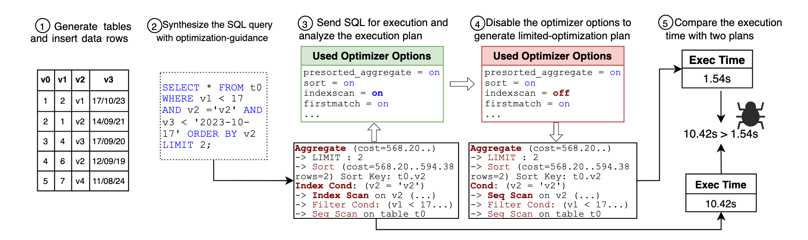

# 问题

数据库中的查询优化器是系统中的关键组件，它的目的是确定给定查询的最优执行计划。但优化器有时会错误选择执行路径，导致Performance Degradation Bugs (PDB)错误。

现有工具如APOLLO和AMOEBA难以深入优化器层面检测性能退化错误，因为它们是完全黑盒的。

# 想法

通过限制优化选项的选择，来检测 PDB。如果限制后的执行时间比限制前的执行时间更短，则认为发现了 PDB，其中有两个挑战：

* 生成触发多样优化操作的 SQL：通过优化指导合成SQL查询解决
* 准确的识别和禁用特定优化选项：通过execution-driven的有限优化计划构造解决

# 方案

步骤：

* 在空数据库中随机生成多种基础表并插入随机分布的数据
* 根据**优化指导**合成SQL查询，覆盖不同的优化操作序列：
  * 在测试 DBMS 前，预定义Clause-Optimization Map，，记录SQL子句与优化操作的关系。例如，WHERE子句可能触发索引扫描优化，ORDER BY子句可能触发排序优化。根据这个 Map，在生成 SQL 时通过选择合适的子句，尽量生成能够触发不同优化操作的SQL查询
  * 记录测试中已生成的优化操作序列，这是一个元组，例如(Seq Scan, Index Scan, Sort, LIMIT)，描述优化器生成计划时涉及的关键优化操作。如果 SQL 触发了新的优化操作序列，将其保存作为进一步生成的种子
* Execution-driven的有限优化计划构造：
  * 在测试 DBMS 前，预定义Operation-Option Mapping，将执行计划中的优化操作映射到具体优化器选项，如Bitmap Scan映射到enable_bitmapscan
  * 根据上一步测试中已生成的优化操作序列，提取其中涉及的优化操作序列，随机选出一部分需要禁用的选项
* PDB Detection：比较全面优化计划和有限优化计划的性能，设定一个性能退化阈值（Degradation Margin），如 1.5，如果执行时间比值超过阈值，则检测到性能退化错误

# 实验

* 在5种主流DBMS（MySQL、Percona等）中发现62个PDB，其中54个为新发现的错误
* 对比APOLLO和AMOEBA，PUPPY分别多检测出26和25个性能错误，覆盖了更多分支
* 引入优化操作序列指导后，触发的优化操作序列数量增加了55%，检测的PDB数提升了67%
