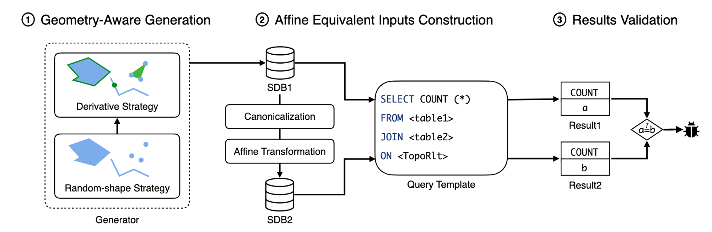

# 问题

目前，大多数现有的研究工作，还是集中在对传统数据库的测试上。空间数据库中的逻辑问题还缺乏解决方案。

# 想法

通过构造在几何意义上等价的输入数据，来检测数据库中的逻辑错误，核心思想：拓扑关系（如相交、相离)在仿射变换之后，是保持不变的。

# 方案

* 构建一个测试用的空间数据库SDB1
  * 随机形状策略
  * 派生形状策略
* 对SDB1 里的每个图形，做一个规范化处理，比如把不同但本质相同的图形表示方式，统一成一个标准的形态。或者再对这些图形应用仿射变换，生成另一套几何图形，得到SDB2
* 设计了一些带有占位符的 SELECT查询，然后随机填充这些占位符，分别在 SDB1 和 SDB2 上执行。如果返回的结果不一致，那就说明：同一个查询，在两个几何等价的数据库上，给出了不同的结果。

# 实验

* 在真实数据库上的检测出的逻辑问题
* Bug 的 Case Study
* 和现有工具做对比，差分测试/ Index/ TLP
* 实验效率分析：Spatter 的执行时间、Coverage 分析、消融实验
