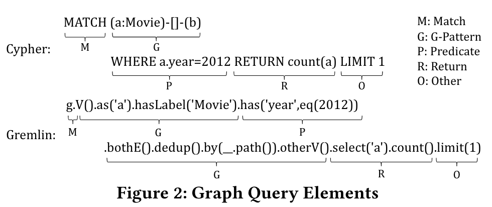
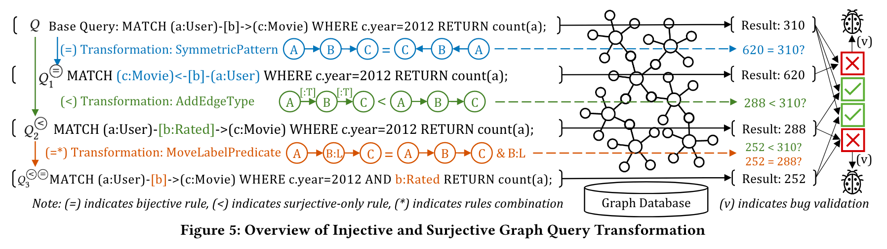

# 问题

为了自动化测试**图形数据库**的逻辑错误，重要的是建立测试准则。

现有方法：

* 差分测试：由于不同图数据库的实现不同，很容易造成**误报**
* 变质测试（蜕变测试）：现有工作是TLP，但该方法只针对谓词部分进行变换，没有考虑图模式（Graph Pattern）

# 想法

考虑针对**图模式**的测试方法，图模式是图查询的一部分：

借鉴函数关系来描述图模式的关系，定义图模式的>，<，=关系。

# 方案

1. 模式扫描：开始时收集模式信息来创建有意义查询
2. 生成基本查询：生成语法正确的基本查询，还可以结合更多的生成有效查询的工作进行使用如SQLancer、SQLsmith
3. 查询突变：使用提出的规则进行突变
4. Bug验证：比较查询结果

# 实验

1. Bugs
2. 与现有工作对比，如Grand、GDBMeter：比较24小时内找到的Bug增长情况
3. 分析每个变异规则：分别分析每个规则能够检测的Bug数
4. 能否检测其他问题如性能问题

# 总结

提出了一种新的方法GQT（*Graph Query Transformation*），通过构建图模式的比较关系来进行检测。
