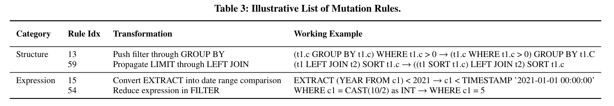
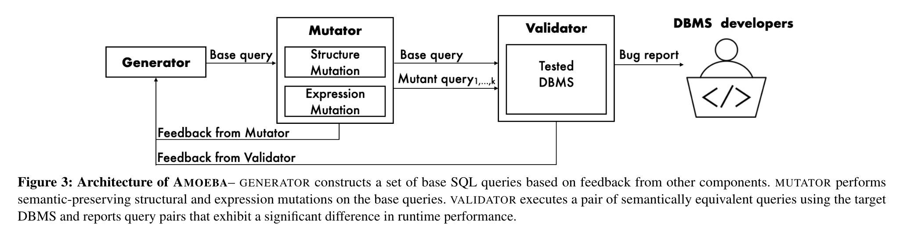

# 问题

数据库中的**性能错误**还缺乏研究，问题是如何定义合适Oracle。过往工作主要有两类：

1. 使用预定义的基线：

* 需要领域知识
* 基准涵盖范围有限

2. 在同一个数据库差分测试：

* 只能检测回归错误

# 想法

构造语义等价查询来进行差分。

# 方案

变异等价查询：基于保持等价的关系代数变换来修改查询结构。

# 实验

* Bug：Performance降低情况 + 开发者反馈 + 举例
* Efficiency：Bug的Unique数目 + False Positive情况 + 生成的查询的数量
* 不同Mutation Rule种类的作用
* Baseline对比

# 总结

本论文提出构造等价查询对数据库性能问题进行检测，实验做的很详细扎实。可以多学习实验思路。
