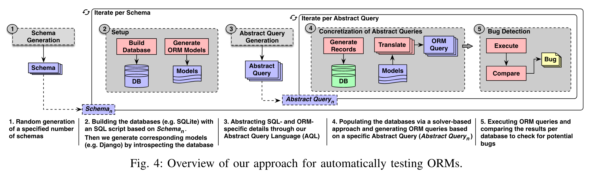

# 问题

尽管ORM系统在工业界已经得到广泛应用，但如何进行测试仍然是一个被忽视的问题。当前主要使用手动编写测试。

# 想法

通过生成等效的ORM查询来进行查分测试，为了避免空结果，基于求解器的方法来对生成的查询插入相应的数据库数据。

挑战：

* ORM框架设计缺乏统一规范
* 查询结果可能根据DBMS实现存在不确定性（如返回结果的顺序不同）
* 存在针对某个DBMS特定的实现问题，需要在不同DBMS上进行查分来发现这类问题
* 生成适当的数据来填充数据库

# 方案

* 生成数据库schema，并基于此构建orm模型
* 针对每个schema生成AQL，并根据求解器生成对应的数据
* 使用差分对比

# 实验

* Bug数 + Bug类型
* 有效性

# 总结

论文的思路和数据库连接器的测试很相似。但不同的是ORM框架没有SQL的存在，因此需要更细致的考虑。
