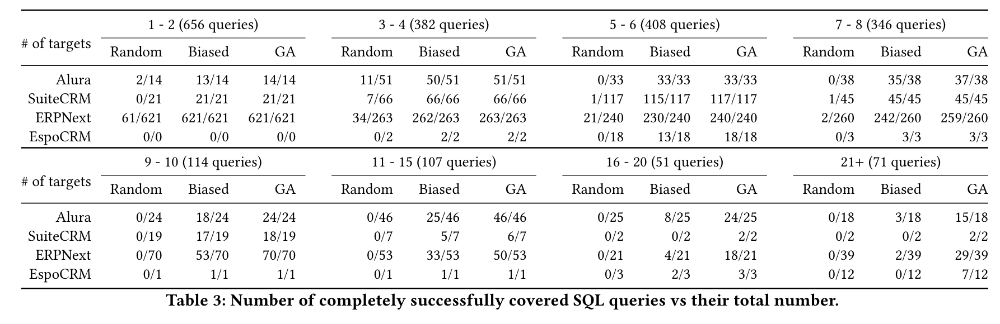

# 问题

为了对SQL进行测试，需要生成对应的测试数据，这是非常困难且耗时的。过往方法一般通过约束求解器求解。这种方法不能很好地支持字符串以及复杂SQL。

# 想法

使用基于遗传算法的搜索方法来建模问题。

# 方案

1. 根据物理查询计划定义Fitness Function
2. 使用搜索算法进行搜索

# 实验

对三种不同的搜索算法准确率进行分析：

# 总结

该论文提出使用搜索算法来生成数据，以接近查询计划为目标。达到了较高的准确率和效率。
