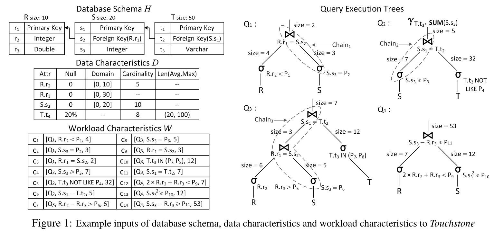

# 问题

数据生成的应用包括对数据库的测试、生成Benchmark、对数据库应用程序的测试。但由于隐私原因，生产中的内部数据很难用于测试。因此需要考虑生成与目标查询具有相似负载的数据。

现有工作仅根据数据分布信息来生成，但无法保证执行SQL时的工作负载。而尝试Query-aware的生成器，由于缺乏并行化等手段不能生成庞大数据。

# 方案

输入：数据库模式H，数据特征D和工作负载特征W

输出：数据库实例和查询，使得数据严格遵循数据特征D；且执行查询时能符合W的预期输出基数

将查询中的约束分为以下四种：$C^{σ}_{=} = {2, 5, 8, 10}, C^{σ}_{\neq} = {1, 4, 7, 12, 13}, C^{\Join}_{=} = {3, 6, 9, 11}, C^{\Join}_{\neq} = {14}$

步骤：

* 查询实例化：
  * 构建每个非键列的随机列生成器，初始化每个常数值等概率
  * 为SQL查询中的变量参数找到具体值
    * 等值关系：使用列生成器中保存的常数来实例化SQL中的常数，并且根据基数情况调整列生成器概率表的概率值
    * 非等值关系：二分查找+随机采样
    * 非等值连接：二分查找+随机采样，但需要自下而上的查找，将子树的值也作为输入参数
* 生成数据：将列生成器的输出组装成元组
  * 编译：
    * 分析表之间的主键和外键约束，构成表之间的依赖图
    * 分析查询树中的$C^{\Join}_{\neq}$约束关系，主要是Filter、PK、FK
  * 组装：
    * 首先递增生成主键值 + 随机填充列值，外键暂时留空
    * 根据已生成的主键，填充外键值
    * 如果一个元组满足约束链中所有的条件，则该元组被接受并进入最终数据集

# 实验

在TPC-H中的前16个查询上进行试验：

* 与MyBenchmark对比性能与资源消耗
* 生成Query的时间和误差

# 总结

该论文结合统计和搜索的方式来生成数据库中的数据。但论文只在TPC-H上进行了实验，并且选择SQL的规模较小。
